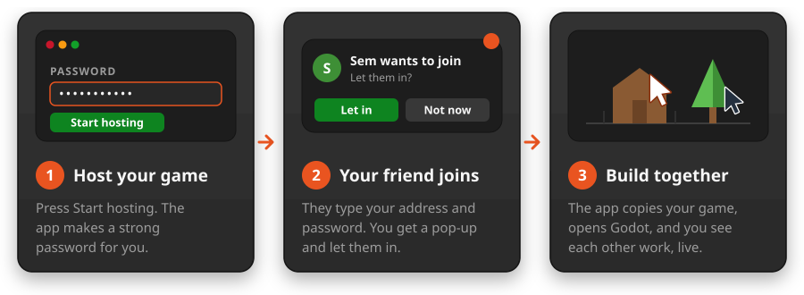
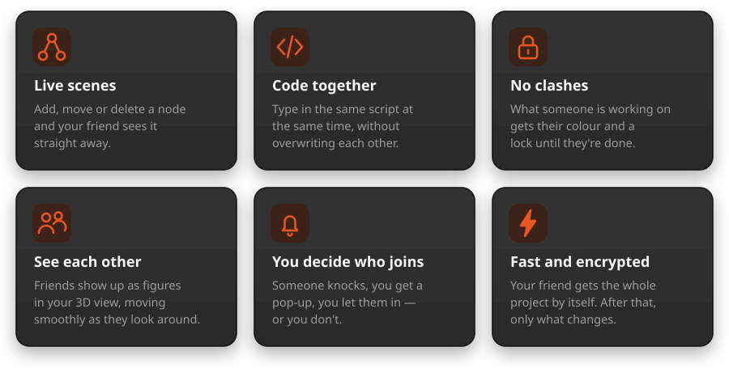
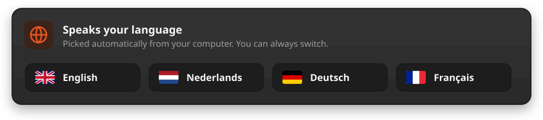

  

  <b>Build Godot games together with your friends — live, in the same project.</b> 
  Not affiliated with or endorsed by the Godot Foundation.

  
  
  
  

---

## What is it?

GodotBuildTogether lets you and your friends work on **the same Godot game at the
same time**. Your friend moves a tree — you see the tree move. You change a
script — they see the change as you type.

If you've used **Team Create in Roblox Studio**, you already know the idea: one
person opens up the game, the others join, and everybody builds in the same
world together. GodotBuildTogether brings that to Godot.

It's made to be simple. No servers of your own to set up, no files to send back and forth,
no zips. **Download it, start it, and begin.**

## How it works

  

There are two parts, and you get both in one download:

- **The app** — a small window that does the heavy lifting: it lets people in,
  copies the project to your friend, and keeps the connection running.
- **The Godot add-on** — lives inside the Godot editor and sends every change you
  make to the others, and theirs to you.

Your friend doesn't need to install the add-on by hand. The app brings it along
with the project, and keeps it up to date.

## What you can do

  

### Supported languages

  

## What you need

- **Godot 4.7** — everybody needs it installed.
- **Linux or Windows.**
- **To play over the internet:** the person who hosts uses
  [playit.gg](https://playit.gg) (free) with a **UDP** tunnel. No port
  forwarding needed. On the same network you don't need it at all.

<b>For techies</b>

 

- Everything runs over **one UDP port** (default `7654`) using ENet with
  **DTLS** encryption. Channel 0 carries the live session, channel 1 carries
  files, so a big download never holds up an edit.
- Files are pulled in chunks of 1 MB over several parallel connections. Every
  chunk is checked with SHA-256 and compressed with zstd when that makes it
  smaller.
- The host's certificate is currently self-signed and not yet pinned by the
  joiner. The connection is encrypted, but it doesn't yet prove *who* is on the
  other end. Pinning is planned.
- Network data is decoded without objects (`bytes_to_var`), and every path that
  comes in is checked so it can never point outside the project folder.
- Script co-editing uses a CRDT, so edits from two people merge instead of
  overwriting each other.
- Written in GDScript only. No GDExtension, nothing to compile.

## Credits

The Godot add-on started as a fork of
**[GodotWithU](https://github.com/Airyshtoteles/GodotWithU)** by
**Airyshtoteles**. His work laid the foundation for the live scene sync, the
shared script editing and the node locks. A lot has been rewritten and added
since, but parts of his code are still in there — thank you!

The app and everything added to the add-on after the fork are made by
**[Linux Ginger](https://github.com/Linux-Ginger)** together with
**Claude**, an AI by Anthropic. Most of the code was written with Claude's
help; the ideas, the choices and the testing are Linux Ginger's.

## Licence

GodotBuildTogether is free and open source under the
**[GNU GPL v3.0 or later](LICENSE)**. You may use it, change it and share it —
as long as whoever gets your version also gets the source, under the same
licence.

The parts that come from Airyshtoteles's original remain available under the
MIT licence, see [LICENSE.MIT](LICENSE.MIT). [NOTICE.md](NOTICE.md) explains
exactly who made what.

## Trademarks

Linux Ginger is not affiliated with or endorsed by the Godot Foundation.
Linux Ginger uses the GODOT® name under a permissive license granted by the
Godot Foundation. The Godot name and logo are trademarks of the Godot
Foundation; the logo is not used in this project.

Roblox and Roblox Studio are trademarks of Roblox Corporation. GodotBuildTogether
is not affiliated with Roblox; the comparison is only there to explain the idea.

Made with ❤ by Linux Ginger &amp; Claude

